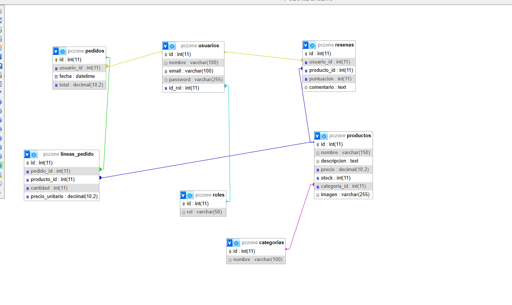

# Base de Datos

## Nombre de la base de datos

pczone

---

# Tabla usuarios

## Campos

- id
- usuario
- correo
- password
- rol

---

# Tabla productos

## Campos

- id
- nombre
- descripcion
- precio
- stock
- imagen
- categoria_id

---

# Tabla categorias

## Campos

- id
- nombre

---

# Relaciones

La tabla productos está relacionada con categorias mediante categoria_id.

### Captura

