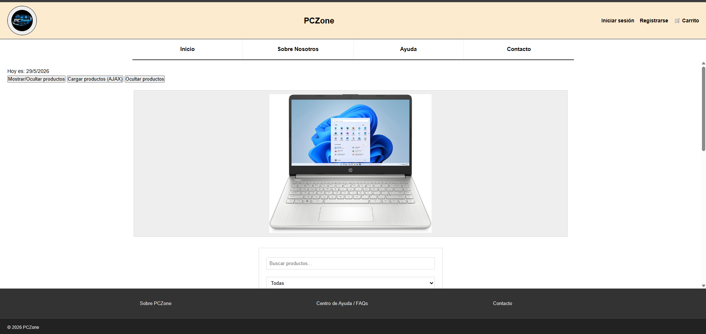
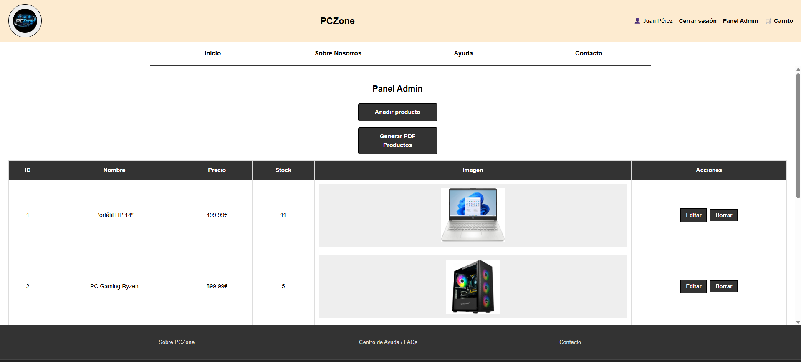
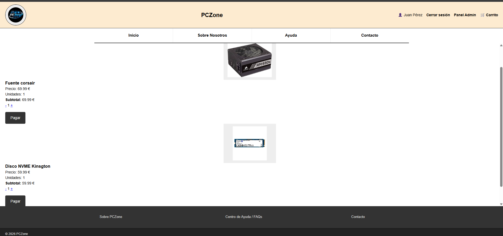
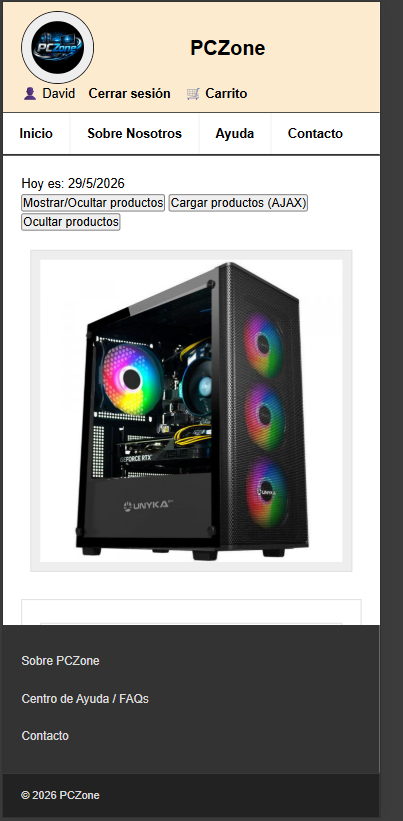

# PCZONE

PCZone es una tienda online desarrollada con PHP,MySQL,JavaScript y CSS.

# 💻 PCZONE

[Inicio](index.md) | [Estructura](estructura.md) | [Funcionalidades](funcionalidades.md) | [Base de Datos](base-datos.md) | [JavaScript](javascript.md) | [CSS](css.md) | [Instalación](instalacion.md)

## Tecnologías usadas
- PHP
- MySQL
- JavaScript
- CSS
- HTML5
- AJAX
- JQuery

## Funcionalidades principales
-Registro de usuarios
-Inicio de sesión
-Carrito de compra
-CRUD de productos
-Panel administrador
-Filtros de productos
-Buscador dinámico
-Slider de imagenes
-Gestión de stock
-Diseño responsive
-Validaciones JavaScript
-Manipulaciones DOM
-AJAX

## Capturas de pantalla

## Página principal

### Panel administrador

### Carrito

### Responsive móvil

